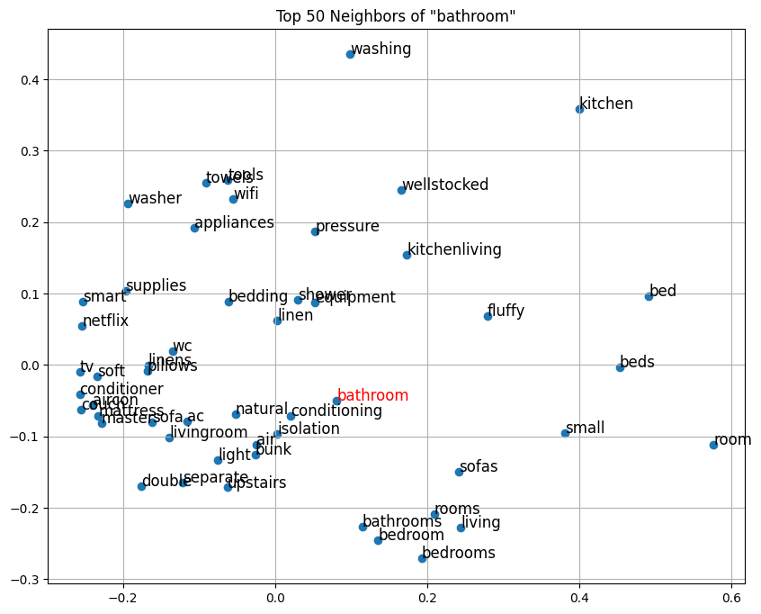

# athens-airbnb-data-analysis

This project analyzes Airbnb listings in Athens using **data mining** and **natural language processing** techniques.  
It consists of two main parts: data exploration and sentiment analysis, followed by semantic similarity modeling.




<br />

# Installation
The datasets are available [here](https://www.kaggle.com/datasets/gerasimosbekos/athens-data), either for manually download or for direct API use.

For running locally, create and activate a virtual environment:
- For Mac/Linux:
```
python3 -m venv .venv
source .venv/bin/activate
```
- For Windows:
```
python -m venv myenv
myenv\Scripts\activate
```
Install the requirements:
```
pip install -r requirements.txt
```

Add your environment as a Jupyter kernel:
```
pip install ipykernel
python -m ipykernel install --user --name=myenv --display-name "Python (.venv)"
```

Open your code editor, select the kernel "Python (.venv)" (or the display name you just set)


When finished, deactivate:
```
deactivate
```
<br />

# Project Structure
- ## Part 1 — Data Exploration & Cleaning

    - **Data Cleaning:** Handling missing values, removing irrelevant records, and preparing datasets.
    - **Exploration:** Finding most common room types, top neighborhoods, and pricing trends.
    - **Visualization:** Creating maps (Folium), charts, and word clouds to understand spatial and textual data.
    - **Feature Engineering:** Grouping amenities and categorizing neighborhoods by price tiers.

- ## Part 2 — Sentiment & Similarity Analysis

    - **Data Sampling:** Randomly selecting English-language reviews for multiple years.
    - **Text Cleaning:** Removing stop words, links, HTML tags, hashtags, and non-ASCII characters.
    - **Labeling:** Using a Hugging Face model for sentiment classification.
    - **Feature Engineering:** TF-IDF vectorization and Word2Vec embeddings for text representation.
    - **Modeling & Evaluation:** Classification using SVM, Random Forests, and K-Nearest Neighbors (KNN). Evaluation via 10-fold cross-validation and accuracy reports.
    - **Semantic Similarity Analysis:** Computation of cosine and Jaccard similarity between words. Identification of semantic neighborhoods using Word2Vec embeddings. Visualization of word relationships through PCA projections.
    
    <br />

# Team Members:
- Dimitrios Stefanos-Porichis
- Gerasimos Bekos
