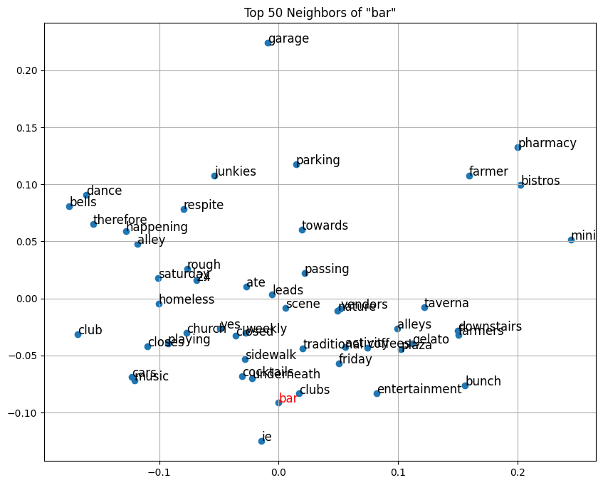

# athens-airbnb-data-analysis

This project analyzes Airbnb listings in Athens using **data mining** and **natural language processing** techniques.  
It consists of two main parts: data exploration and sentiment analysis, followed by semantic similarity modeling.

# Project Structure
 ## Part 1 — Data Exploration & Cleaning

- **Data Cleaning:** Handling missing values, removing irrelevant records, and preparing datasets.
- **Exploration:** Finding most common room types, top neighborhoods, and pricing trends.
- **Visualization:** Creating maps (Folium), charts, and word clouds to understand spatial and textual data.
- **Feature Engineering:** Grouping amenities and categorizing neighborhoods by price tiers.

## Part 2 — Sentiment & Similarity Analysis

- **Data Sampling:** Randomly selecting English-language reviews for multiple years.
- **Text Cleaning:** Removing stop words, links, HTML tags, hashtags, and non-ASCII characters.
- **Labeling:** Using a Hugging Face model for sentiment classification.
- **Feature Engineering:** TF-IDF vectorization and Word2Vec embeddings for text representation.
 - **Modeling & Evaluation:** Classification using SVM, Random Forests, and K-Nearest Neighbors (KNN). Evaluation via 10-fold cross-validation and accuracy reports.
 - **Semantic Similarity Analysis:** Computation of cosine and Jaccard similarity between words. Identification of semantic neighborhoods using Word2Vec embeddings. Visualization of word relationships through PCA projections.

# Team Members:
- Dimitrios Stefanos-Porichis
- Gerasimos Bekos
